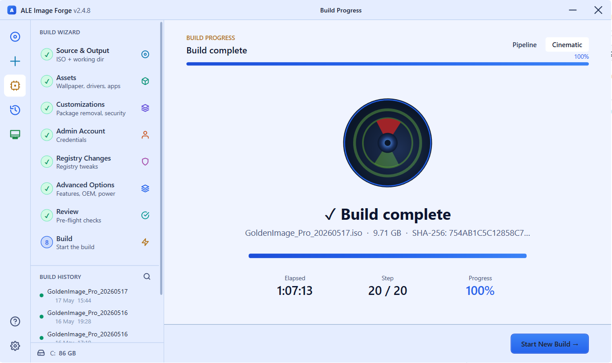
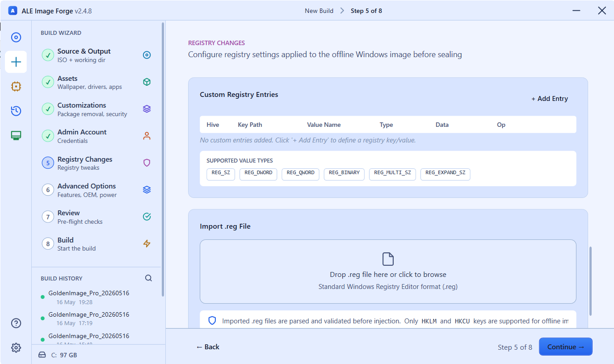
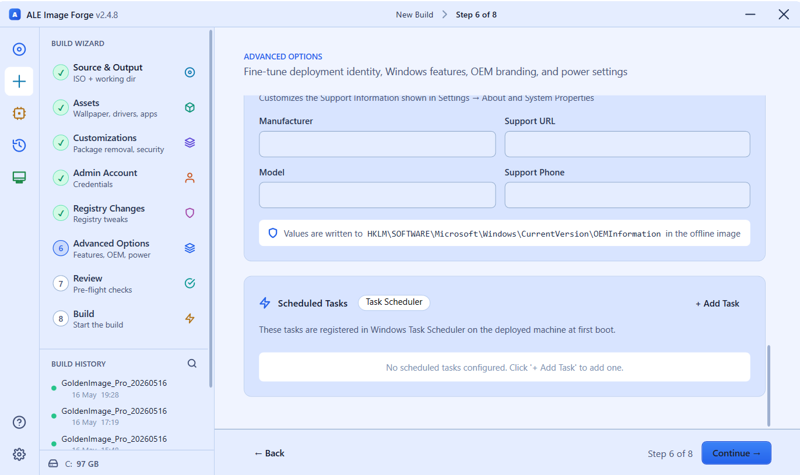
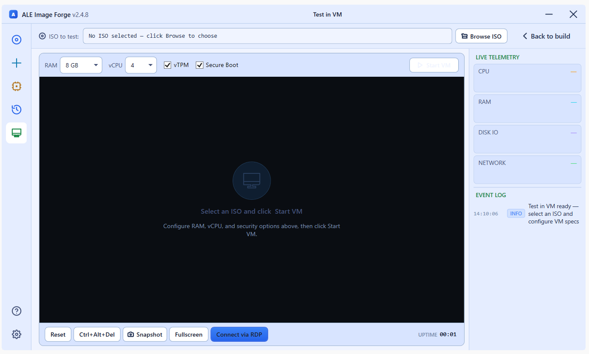

<div align="center">


<br/><br/>

# ⚒️ WinForge

### Build a production-ready, fully-customised Windows 11 ISO — in a single guided wizard.

**No golden VM. No Sysprep. No manual steps after imaging.**

<br/>

[](https://github.com/IamPavanGS/WinForge/releases)
[](https://dotnet.microsoft.com)
[](https://microsoft.com/windows)
[](LICENSE)
[](https://github.com/IamPavanGS/WinForge/stargazers)

<br/>

> **3–4 weeks** of manual golden-image work → **3–4 days** with WinForge.
> Every config, driver, policy, app, and registry tweak — baked directly into the ISO.

<br/>

[**⬇️ Download Latest**](https://github.com/IamPavanGS/WinForge/releases) · [**📸 Screenshots**](#-screenshots) · [**🚀 How It Works**](#-how-it-works) · [**✨ Features**](#-what-gets-baked-in) · [**🛠 Build from Source**](#building-from-source)

</div>

---

## 🔥 The Problem

Every Windows deployment cycle looks like this:

```
Week 1  →  Install base Windows on VM
Week 2  →  Apply policies, inject drivers, configure security baseline
Week 3  →  Install applications, test auto-logon, validate Sysprep
Week 3+ →  New requirement arrives — start over from scratch
Week 4  →  Boot on real hardware — issue found — start over again
           ^^^^^^^^^^^^^^^^^^^^^^^^^^^^^^^^^^^^^^^^^^^^^^^^^^^^
                         3 to 4 WEEKS total
```

A single missed driver, a broken MSI argument, or a last-minute policy change means **you rebuild from zero**. There is no partial recovery. There is no "just fix the one thing." The entire cycle restarts.

**And after all that work, the result is a snapshot in time** — a fragile VM that drifts, requires maintenance, and cannot be reproduced identically on another machine.

---

## ⚡ The WinForge Way

```
Day 1  →  Open WinForge, load vanilla Windows 11 ISO
Day 1  →  8-step wizard: drivers, apps, policies, registry, branding — all in one pass
Day 2  →  New requirement arrives — change one setting, rebuild
Day 3  →  ISO ready — boot on real hardware — done
          ^^^^^^^^^^^^^^^^^^^^^^^^^^^^^^^^^^^^^^^
                       3 to 4 DAYS total
```

WinForge works **directly against the mounted WIM** using DISM and `reg.exe`. No VM. No Sysprep. No state to maintain. A `.gibprofile` saves your entire config — rebuild an identical ISO a year later on any machine with one click.

---

## 📸 Screenshots

<table>
<tr>
<td width="50%">


**Live build pipeline** — 19-stage pipeline with real-time log, elapsed time, and step-level status

</td>
<td width="50%">


**Build complete** — 9.71 GB ISO, 20/20 steps passed, SHA-256 verified in 1h 07m

</td>
</tr>
<tr>
<td width="50%">


**Customizations** — Bloatware removal, privacy baseline, security toggles, Group Policy injection

</td>
<td width="50%">


**Pre-commit validator** — 96% health score, 104 checks passed, 0 failed — before DISM commits a byte

</td>
</tr>
<tr>
<td width="50%">


**Cinematic view** — full-screen build mode with animated progress for presentations and walkthroughs

</td>
<td width="50%">


**Registry editor** — inject any key/value directly into the offline WIM hive (HKLM or Default User)

</td>
</tr>
<tr>
<td width="50%">


**OEM Branding** — org name, support URL, logo, product key, OOBE skip

</td>
<td width="50%">


**Test in VM** — boot the ISO inside Hyper-V (Gen 2, Secure Boot, TPM 2.0) without leaving the app

</td>
</tr>
</table>

---

## 🚀 How It Works

WinForge runs a **19-stage offline pipeline** against the mounted WIM. Nothing touches a running OS. Nothing requires a VM or Sysprep.

```
┌─────────────────────────────────────────────────────────────────┐
│                        WinForge Pipeline                        │
├──────┬──────────────────────────────────────────────────────────┤
│   1  │  Validate  — admin check, tool presence (dism, oscdimg)  │
│   2  │  Prepare   — clean workspace, purge orphaned WIM mounts  │
│   3  │  Copy ISO  — mount source ISO, robocopy to workspace     │
│   4  │  Export    — DISM /Export-Image to single-edition WIM    │
│   5  │  Mount WIM — DISM /Mount-Image /Index:1                  │
│   6  │  Lang Packs — DISM /Add-Package per selected CAB         │
│   7  │  Drivers   — DISM /Add-Driver /Recurse (local or OEM)    │
│   8  │  Wallpaper — takeown + overwrite all system wallpapers    │
│   9  │  FirstBoot — stage GIBFirstBoot.exe + apps.json into WIM │
│  10  │  Desktop   — files staged to Users\Public\Desktop        │
│  11  │  Scripts   — deployment scripts + Startup trigger        │
│  12  │  Bloatware — DISM /Remove-ProvisionedAppxPackage         │
│  13  │  Features  — Enable / Disable optional Windows features  │
│  14  │  Registry  — offline hive load → reg.exe → unload        │
│  15  │  Unattend  — generate Autounattend.xml + SetupComplete    │
│  16  │  Validate  — ⚠️ FULL pre-commit inspection of WIM        │
│  17  │  Unmount   — DISM /Unmount-Image /Commit                 │
│  18  │  Build ISO — oscdimg UEFI + BIOS dual-boot               │
│  19  │  Verify    — SHA-256 checksum of final ISO               │
└──────┴──────────────────────────────────────────────────────────┘
```

**Stage 16 is your safety net.** The pre-commit validator inspects the mounted image *before* `DISM /Commit`. If anything is wrong — missing installer, broken auto-logon, misconfigured BitLocker — the build halts with a full HTML report while the WIM is still recoverable. You never lose a 2-hour build to a silent misconfiguration.

---

## ✨ What Gets Baked In

| Category | What WinForge injects |
|---|---|
| 🔄 **Windows Updates** | Cumulative update + checkpoint chain — machines boot fully patched |
| 🚗 **OEM Drivers** | Auto-fetch Dell / HP / Lenovo driver packs, or inject from local folders |
| 📦 **Applications** | Any MSI / EXE / MST — silently installed at first user login via the bundled first-boot launcher |
| 🔒 **Security** | Remove bloatware, disable Copilot / Recall / Widgets, SMBv1 off, Defender ATP, BitLocker with optional key export |
| 📋 **Group Policy** | Machine + user policies applied offline — no domain controller required at build time |
| 🎨 **Branding** | Wallpaper, lock screen, OEM support info, org logo, trusted certs, custom fonts, registry tweaks |
| 🤫 **Unattended Setup** | Full `Autounattend.xml` — zero clicks from boot to desktop, no OOBE interaction |
| 🏷️ **Auto-Rename** | First-boot hostname from template: `{PREFIX}{SERIAL}`, `{PREFIX}{LAST6_MAC}`, `{PREFIX}{ASSETTAG}` |
| 🧪 **Test in Hyper-V** | Boot the produced ISO in a Gen 2 / Secure Boot / TPM 2.0 VM directly from the app |

---

## 🧙 The 8-Step Wizard

| Step | Page | What you configure |
|---|---|---|
| **1** | **Source & Output** | Vanilla Win 11 ISO, target edition, boot language, output folder |
| **2** | **Assets** | Wallpaper, staged apps, language packs, OEM drivers, deployment scripts, fonts |
| **3** | **Customizations** | Bloatware removal, Win 11 UX defaults, security toggles, certs, Group Policies |
| **4** | **Admin Account** | Username, password, auto-logon, password-never-expires |
| **5** | **Registry** | Custom keys into `HKLM\SOFTWARE`, `HKLM\SYSTEM`, or Default User hive |
| **6** | **Advanced** | Optional features, OEM branding, product key, OOBE skip, power plan, timezone, scheduled tasks |
| **7** | **Review** | Full summary of every choice — save or load a `.gibprofile` config file |
| **8** | **Build** | Live 19-stage pipeline with cinematic view + detailed log |

---

## 🎯 Who This Is For

- **IT Administrators** deploying Windows 11 at scale — 10 machines or 10,000
- **Sysadmins** tired of maintaining a golden VM that drifts and breaks
- **Enterprise teams** that need reproducible, auditable, policy-compliant images
- **MSPs** that need to rapidly produce per-client customised builds

---

## 📋 Requirements

| Requirement | Details |
|---|---|
| **OS** | Windows 11 on the build machine (build 17763+) |
| **Privileges** | Run as Administrator (DISM requires elevation) |
| **Windows ADK** | Deployment Tools component (`oscdimg.exe`) — WinForge can install this automatically |
| **Disk space** | ~30 GB free on workspace drive |
| **Hyper-V** | Optional — only needed for "Test in VM" |

---

## ⬇️ Installation

Download the latest installer from [**Releases**](https://github.com/IamPavanGS/WinForge/releases):

```
WinForge-Setup-2.4.8.exe
```

Installs to `%ProgramFiles%\WinForge\`. Requires administrator privileges. Settings survive uninstall and reinstall.

---

<details>
<summary><strong>🔧 Building from source</strong></summary>

```powershell
# 1. Build GoldenISOBuilder (automatically builds GIBFirstBoot too)
cd GoldenISOBuilder
dotnet build -c Release -p:Platform=x64 --nologo

# 2. Publish as a single self-contained executable
dotnet publish -c Release -p:Platform=x64 -r win-x64 --self-contained true `
    -p:PublishSingleFile=true `
    -p:IncludeNativeLibrariesForSelfExtract=true `
    -p:EnableCompressionInSingleFile=true --nologo

# 3. Compile Inno Setup installer (requires Inno Setup 6)
& "$env:LOCALAPPDATA\Programs\Inno Setup 6\ISCC.exe" Installer\WinForge.iss
```

Output: `GoldenISOBuilder\bin\x64\Release\net8.0-windows10.0.17763.0\win-x64\publish\`

</details>

<details>
<summary><strong>🏗️ Architecture overview</strong></summary>

Two projects in one solution:

| Project | Role | Size |
|---|---|---|
| **GoldenISOBuilder** | WPF wizard running on the admin's build machine | ~75 MB self-contained |
| **GIBFirstBoot** | Bundled into the ISO at `C:\GIB\` — reads `apps.json`, installs every staged app silently on first user login | ~70 MB |

**Key design decisions:**
- `BuildSession.Current` is the single source of truth — every page reads/writes it directly
- All engine work is `async/await` — UI never blocks
- Passwords are always base64-encoded via `ToPsEncodedCommand()` — never plain text on disk
- Registry writes use `reg.exe`, not PowerShell, for offline-hive compatibility
- `Step()` = fatal (halts pipeline); `StepSoft()` = logs and continues — critical steps are fatal, best-effort steps (drivers, wallpaper, fonts) are soft so one hiccup doesn't waste a 90-min build
- Pre-commit validator runs *before* `DISM /Unmount-Image /Commit` — WIM is still recoverable on failure

</details>

---

## 📦 Version History

| Version | Highlights |
|---|---|
| **2.4.8** | UI polish, Event Log fix, validator AutoLogon + BitLocker regression fixes |
| **2.4.7** | Light-theme fixes, driver-extract freeze fixed, validator extended (drivers, lang packs, wallpaper, bloatware, features, font registry) |
| **2.4.6** | AutoLogon regression fix (removed legacy `setup.exe` path breaking Win 11 OOBE auto-logon) |
| **2.4.5** | Auto-fetch on by default; OS-version-aware Windows Update filter (24H2/25H2 WIM metadata detection) |
| **2.4.1** | OEM driver auto-fetch (Dell/HP/Lenovo catalogs); Windows Update slipstream; WinPE driver filter |
| **2.4.0** | Pre-commit validator + HTML validation report |

---

## 🤝 Contributing

Issues and PRs welcome. Please open an issue first for anything beyond a small bug fix so we can discuss scope before you invest the time.

---

## 📄 License

MIT — see [LICENSE](LICENSE).

---

<div align="center">

Built by **Pavan G S** · BTQ Infra, Alcatel-Lucent Enterprise

*If WinForge saved you time, a ⭐ on GitHub goes a long way.*

</div>
