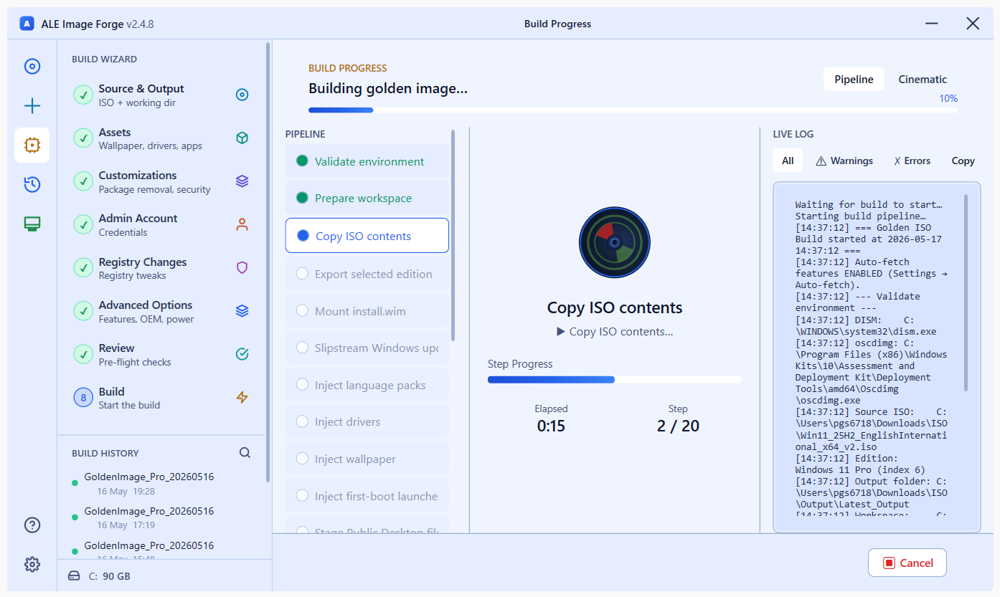
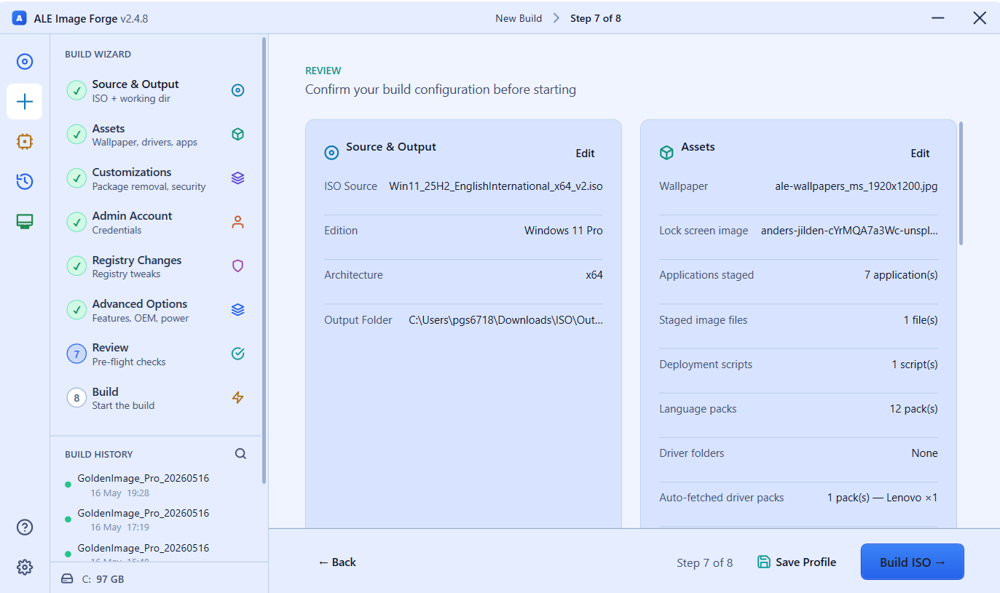
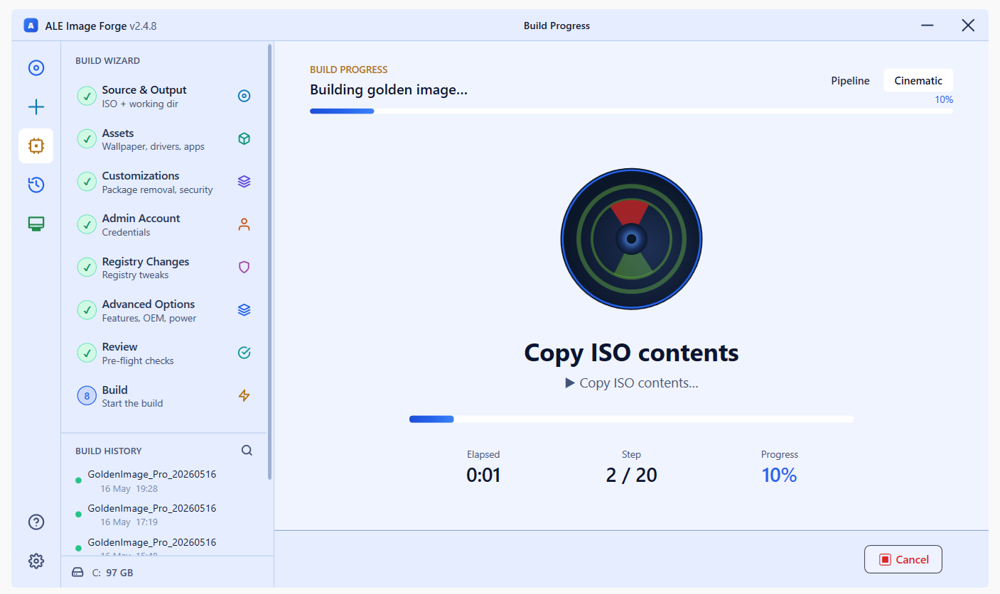
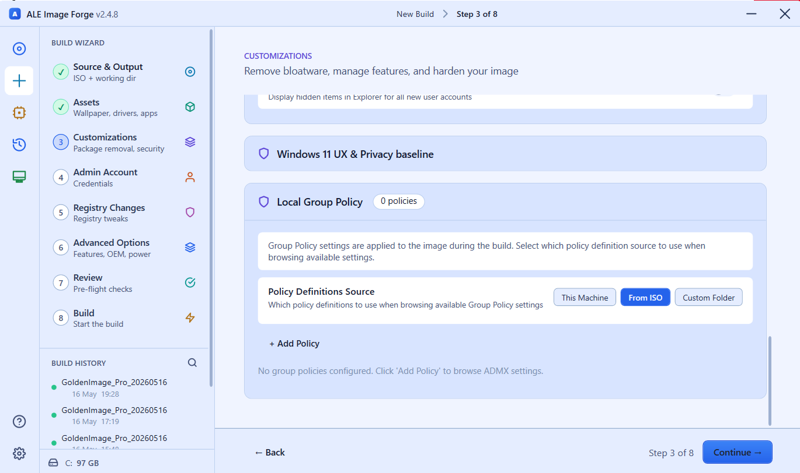
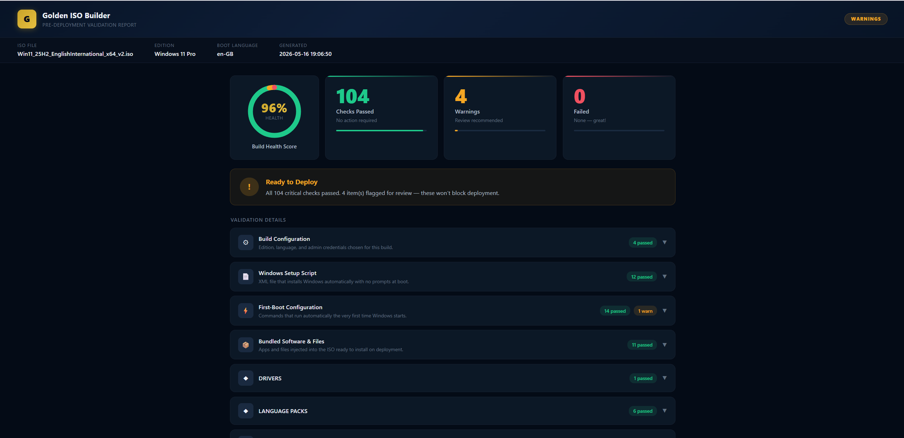

<div align="center">

# WinForge

**Build a fully-customised, deploy-ready Windows 11 ISO in a single guided wizard.**

No template VM. No Sysprep. No manual steps after imaging.

[](https://github.com/IamPavanGS/WinForge/releases)
[](https://dotnet.microsoft.com)
[](https://www.microsoft.com/windows)
[](LICENSE)

<br>



</div>

---

## The problem with Windows deployment

Bare Windows ISOs require dozens of manual steps after every install: drivers, applications, policies, branding, security baselines, BitLocker, language packs — the full list. Every time you image a machine, you're doing the same work again.

**Image Forge collapses all of that into one wizard.** It works entirely offline against the mounted WIM — no Sysprep dance, no golden VM — and produces an ISO that installs unattended, configures itself, and hands the user a fully-operational desktop on first boot.

---

## Screenshots

<table>
<tr>
<td width="50%">


**Review** — Full build summary before you commit to a build

</td>
<td width="50%">


**Build** — 19-stage pipeline with cinematic progress view

</td>
</tr>
<tr>
<td width="50%">


**Customizations** — Bloatware removal, privacy baseline, Group Policy injection

</td>
<td width="50%">


**Validator** — 96% health score, 104 checks passed, 0 failed — before DISM commits a single byte

</td>
</tr>
</table>

---

## Why Image Forge?

- **Offline, no VM required.** Everything is applied directly to the mounted WIM using DISM and `reg.exe` — no Sysprep, no generalization, no golden image to maintain.
- **Machines arrive ready.** First boot: Windows installs unattended, renames itself, runs your scripts, installs your applications silently, and enables BitLocker — all before the user ever touches the keyboard.
- **Pre-commit validator.** A 19-stage pipeline runs a full inspection of the mounted image *before* committing. If anything is wrong — missing installer, broken certificate import, misconfigured auto-logon — the build fails with a detailed report. Never ship a broken image after a 2-hour wait.
- **Reproducible.** Save your entire configuration as a `.gibprofile` file and reproduce identical images on any build machine, any time.

---

## What gets baked into the ISO

| Capability | Details |
|---|---|
| **Windows Updates** | Pre-install the latest cumulative update and checkpoint chain — machines boot fully patched |
| **OEM Drivers** | Auto-fetch official driver packs from Dell, HP, and Lenovo catalogs, or inject from local folders |
| **Applications** | Stage any MSI / EXE / MST installer — silently installed on the user's first login via the bundled first-boot launcher |
| **Privacy & Security** | Remove bloatware, disable Copilot / Recall / Widgets, apply SMBv1-off / Defender ATP, configure BitLocker |
| **Group Policy** | Apply machine and user policies offline — no domain controller needed at build time |
| **Customization** | Wallpaper, lock screen, OEM branding, trusted certificates, custom fonts, registry tweaks |
| **Unattended Setup** | Full `Autounattend.xml` — no language picker, no upgrade prompt, no OOBE interaction |
| **Hostname Template** | Auto-rename on first boot: `{PREFIX}{SERIAL}`, `{PREFIX}{LAST6_MAC}`, `{PREFIX}{ASSETTAG}`, and more |
| **Test in Hyper-V** | Boot the produced ISO in a Gen 2 / Secure Boot / TPM 2.0 VM directly from the app |

---

## The 8-step wizard

| Step | Page | What you configure |
|---|---|---|
| 1 | **Source & Output** | Pick the vanilla Win 11 ISO, choose the edition, set the boot language and output folder |
| 2 | **Assets** | Wallpaper, staged apps, language packs, drivers (local or OEM auto-fetch), deployment scripts, fonts |
| 3 | **Customizations** | Bloatware removal, Windows 11 UX defaults, security toggles, certificates, Group Policies |
| 4 | **Admin Account** | Username, password, auto-logon, password-never-expires |
| 5 | **Registry** | Custom registry entries (SET or DELETE) into HKLM\SOFTWARE, HKLM\SYSTEM, or the Default User hive |
| 6 | **Advanced** | Optional Windows features, OEM branding, product key, OOBE skip, power plan, time zone, scheduled tasks |
| 7 | **Review** | Summary of every choice; save or load a `.gibprofile` configuration file |
| 8 | **Build** | Runs the 19-stage pipeline with live progress (cinematic view + detailed pipeline view) |

---

## Requirements

- **Windows 11** on the build machine (any edition; build 17763 minimum)
- **Run as Administrator** — DISM and offline registry edits require elevation
- **Windows ADK > Deployment Tools** (for `oscdimg.exe`) — Image Forge can download and install the ADK automatically from within the app if it isn't present
- **~30 GB free disk space** on the workspace drive (WIM mount + ISO staging)
- **Hyper-V** (optional) — only needed for the in-app "Test in VM" feature

The machine being imaged has no special requirements beyond being Win 11-capable hardware.

---

## Installation

Download the latest installer from [**Releases**](https://github.com/IamPavanGS/WinForge/releases):

```
WinForge-Setup-2.4.8.exe
```

The installer requires administrator privileges. It registers a Start Menu shortcut and installs to `%ProgramFiles%\WinForge\`. Settings survive uninstall and reinstall.

---

<details>
<summary><strong>Building from source</strong></summary>

```powershell
# 1. Build GoldenISOBuilder + GIBFirstBoot (GIBFirstBoot is built automatically)
cd GoldenISOBuilder
dotnet build -c Release -p:Platform=x64 --nologo

# 2. Publish as a single self-contained executable
dotnet publish -c Release -p:Platform=x64 -r win-x64 --self-contained true `
    -p:PublishSingleFile=true `
    -p:IncludeNativeLibrariesForSelfExtract=true `
    -p:EnableCompressionInSingleFile=true --nologo

# 3. Compile the Inno Setup installer (requires Inno Setup 6)
& "$env:LOCALAPPDATA\Programs\Inno Setup 6\ISCC.exe" Installer\WinForge.iss
```

Building `GoldenISOBuilder` automatically triggers `dotnet publish` on `GIBFirstBoot` and copies the resulting exe into the publish folder.

Output: `GoldenISOBuilder\bin\x64\Release\net8.0-windows10.0.17763.0\win-x64\publish\`

</details>

---

<details>
<summary><strong>Architecture overview</strong></summary>

Two projects in one solution (`ALE ISO Creator.sln`):

| Project | Role | Output |
|---|---|---|
| **GoldenISOBuilder** | The main WPF wizard (runs on the admin's build machine) | `GoldenISOBuilder.exe` (~75 MB self-contained) |
| **GIBFirstBoot** | First-boot installer bundled into the ISO — reads `apps.json` and installs every staged app silently on first login | `GIBFirstBoot.exe` (~70 MB, lives at `C:\GIB\` inside the deployed image) |

**Key design principles:**

- `BuildSession.Current` is the single source of truth — every wizard page reads and writes it directly; there is no ViewModel layer.
- All engine work is `async`/`await` — the UI thread is never blocked.
- Passwords are always base64-encoded via `ToPsEncodedCommand()` before touching disk — never plain text.
- Registry writes use `reg.exe`, not PowerShell, for offline-hive compatibility.
- `Step()` = fatal (halts build); `StepSoft()` = logs warning and continues. Critical operations use `Step()`; best-effort steps (drivers, fonts, wallpaper) use `StepSoft()` so a single hiccup doesn't lose a 90-minute build.
- The pre-commit validator inspects the mounted WIM **before** `DISM /Unmount-Image /Commit`. Any FAIL stops the build while the image is still recoverable.

See [TECHNICAL.md](TECHNICAL.md) for the full pipeline breakdown, offline hive mapping, and first-boot launcher internals.

</details>

---

## Version history

| Version | Highlights |
|---|---|
| **2.4.8** | UI polish; Event Log fix; validator AutoLogon and BitLocker regression fixes |
| **2.4.7** | Light-theme cosmetic fixes; driver-extract UI freeze fixed; cert dropdown clip fixed; validator extended to cover drivers, language packs, wallpaper, bloatware, features, font registry |
| **2.4.6** | AutoLogon regression fixed (removed legacy `setup.exe` path that broke Win 11 OOBE auto-logon) |
| **2.4.5** | Auto-fetch on by default; OS-version-aware Windows Update filter (24H2 / 25H2 detection from WIM metadata) |
| **2.4.1** | Auto-fetch driver packs from Dell / HP / Lenovo catalogs; Windows Update slipstream from Microsoft Update Catalog; WinPE-critical driver filter |
| **2.4.0** | Pre-commit validator + HTML validation report |

---

## License

MIT — see [LICENSE](LICENSE).

Built by **Pavan G S** — BTQ Infra, Alcatel-Lucent Enterprise.
